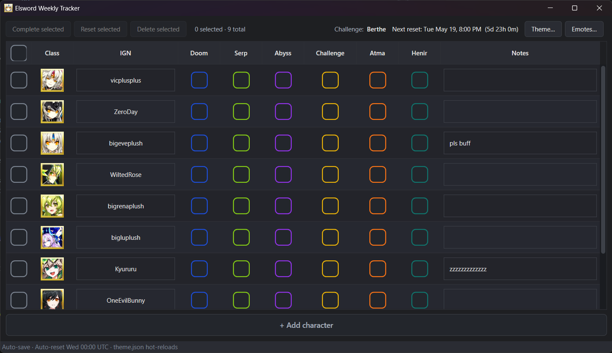

# Elsword Weekly Tracker

A small WPF desktop app for tracking the weekly raid clears of your Elsword
roster. Spreadsheet-style grid, themed checkboxes, auto-reset on Wednesday
00:00 UTC, and one-click clipboard export of "uncleared" lists as Discord
emote messages.



## Features

- One row per character: class icon, IGN, six weekly raid checkboxes
  (Doom, Serp, Abyss, Challenge, Atma, Henir).
- Class picker with searchable icon dropdown built from the `Classes/` folder
  — add a `.png` and it shows up next launch.
- Auto-reset every Wednesday 00:00 UTC. Survives the app being closed across
  the reset boundary (next launch detects it).
- Tri-state row-selection checkbox + bulk actions: **Complete**,
  **Reset**, **Delete** (with confirmation).
- Click a raid column header (Doom/Serp/Abyss/Challenge) to copy a Discord
  emote message of all uncleared characters, e.g.
  `:KE: :Aps: :RV: :EtW: :DoomFresh:`. Challenge picks the right rotation
  emote (Rosso/Berthe).
- Themed checkboxes — colors and challenge rotation are loaded from a JSON
  file that hot-reloads on save.
- Auto-save to JSON. No database, no cloud.

## Install

Download the latest `ElsTracker.exe` from the
[Releases page](../../releases) and run it. No installer, no .NET runtime
required (self-contained single-file build).

The exe is unsigned, so on first launch Windows SmartScreen will show a
"Windows protected your PC" warning. Click **More info → Run anyway**.

## Config files

The app writes two JSON files under `%AppData%\els-tracker\`:

| File           | Purpose                                                        |
| -------------- | -------------------------------------------------------------- |
| `data.json`    | Your characters, weekly state, and last-reset timestamp.       |
| `theme.json`   | Per-raid colors and the Challenge weekly rotation (anchor + cycle). |
| `emotes.json`  | Class-name → abbreviation map and per-raid Discord emote names. |

Both `theme.json` and `emotes.json` hot-reload (200 ms debounce) — edit and
save, the running app picks up the change.

Buttons in the toolbar (**Theme…** / **Emotes…**) open each file in your
default editor.

### Default `theme.json`

```json
{
  "Raids": {
    "Doom":  "#1D4ED8",
    "Serp":  "#84CC16",
    "Abyss": "#9333EA",
    "Atma":  "#F97316",
    "Henir": "#0F766E"
  },
  "Challenge": {
    "AnchorWeekUtc": "2026-05-06T00:00:00Z",
    "Rotation": [
      { "Name": "Rosso",  "Color": "#DC2626" },
      { "Name": "Berthe", "Color": "#EAB308" }
    ]
  }
}
```

The current Challenge raid is computed from `AnchorWeekUtc` and the rotation
length. Adjust the anchor if the in-game rotation drifts.

### Default `emotes.json`

```json
{
  "classAbbreviations": {
    "Knight Emperor": "KE",
    "Apsara": "Aps",
    "...": "..."
  },
  "raidEmotes": {
    "Doom": "DoomFresh",
    "Serp": "SerpFresh",
    "Abyss": "AbyssFresh",
    "Challenge": "ChallengeFresh"
  },
  "challengeRotationEmotes": {
    "Rosso":  "RossoFresh",
    "Berthe": "BertheFresh"
  }
}
```

`challengeRotationEmotes` is consulted first for the Challenge column; if the
current rotation name is not found there, `raidEmotes["Challenge"]` is used
as a fallback.

## Develop locally

```powershell
git clone https://github.com/<your-org>/els-tracker.git
cd els-tracker
dotnet run --project ElsTracker
```

Requirements: .NET 10 SDK with the Windows desktop workload (included by
default on Windows installs of the SDK).

## Build a release exe

```powershell
dotnet publish ElsTracker/ElsTracker.csproj `
  -c Release -r win-x64 --self-contained true `
  -p:PublishSingleFile=true `
  -p:IncludeAllContentForSelfExtract=true `
  -p:EnableCompressionInSingleFile=true `
  -o publish
```

Output: `publish/ElsTracker.exe` — a single self-contained Windows binary.
`Classes/*.png` are embedded in the bundle and extracted alongside the exe
on first run (handled by the .NET runtime, not your code).

## License

MIT. See [LICENSE](LICENSE).
